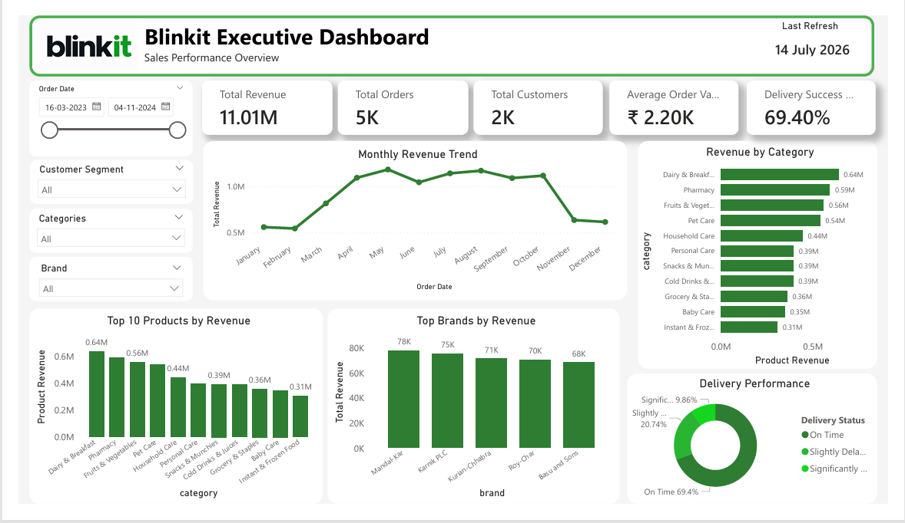
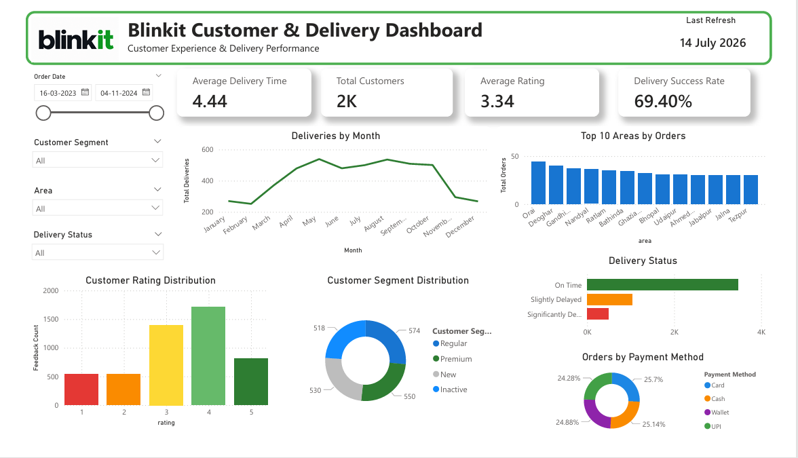
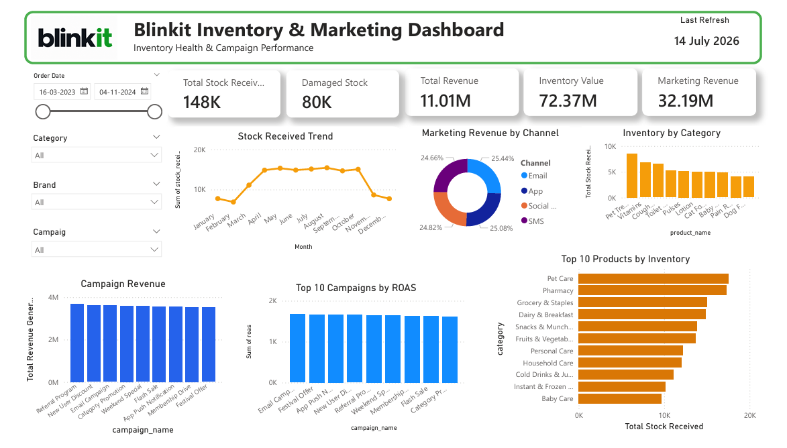

# 🛒 Blinkit Business Intelligence | SQL & Power BI Project




---

## 📌 Project Overview

This project presents an **end-to-end Business Intelligence solution** for Blinkit's e-commerce operations using **MySQL** and **Power BI**. It covers the complete analytics workflow, from database design and SQL analysis to interactive dashboards that support business decision-making.

---

## 🎯 Project Objectives

- Design a relational database for e-commerce analysis.
- Import and validate data from multiple datasets.
- Analyze sales, customers, products, inventory, delivery, and marketing performance.
- Apply advanced SQL techniques for business analysis.
- Build interactive Power BI dashboards.
- Generate actionable business insights and recommendations.

---

## 🛠️ Tools & Technologies

- **Database:** MySQL
- **SQL IDE:** MySQL Workbench
- **Visualization:** Power BI
- **Data Preparation:** Microsoft Excel

---

## 📂 Dataset Summary

| Table | Records |
|--------|---------:|
| Customers | 2,500 |
| Orders | 5,000 |
| Products | 268 |
| Order Items | 5,000 |
| Inventory | 75,173 |
| Delivery Performance | 5,000 |
| Customer Feedback | 5,000 |
| Marketing Performance | 5,400 |

---

## 🗄️ Database Design

The project uses a **normalized relational database** with **8 interconnected tables** linked through **Primary Keys** and **Foreign Keys** to ensure data integrity.

### Tables

- Customers
- Orders
- Order Items
- Products
- Inventory
- Delivery Performance
- Customer Feedback
- Marketing Performance

---

## 🔄 Project Workflow

```text
CSV Files
     │
     ▼
MySQL Database
     │
     ▼
Data Cleaning & Validation
     │
     ▼
SQL Business Analysis
     │
     ▼
Power BI Dashboards
     │
     ▼
Business Insights & Recommendations
```

---

## ✅ Data Validation

The following data quality checks were performed:

- ✔️ Row Count Validation
- ✔️ Duplicate Record Check
- ✔️ Missing Value Check
- ✔️ Foreign Key Validation
- ✔️ Business Rule Validation

---

## 💻 SQL Skills Demonstrated

- Joins
- Aggregate Functions
- GROUP BY & HAVING
- CASE Statements
- Subqueries
- Common Table Expressions (CTEs)
- Window Functions


---

## 📊 Power BI Dashboards

### 📌 Executive Dashboard

- Total Revenue
- Total Orders
- Total Customers
- Average Order Value
- Delivery Success Rate
- Monthly Revenue Trend
- Revenue by Category
- Top Products
- Top Brands

### 👥 Customer & Delivery Dashboard

- Customer Segment Analysis
- Customer Ratings
- Delivery Performance
- Delivery Status
- Orders by Area
- Payment Method Distribution

### 📦 Inventory & Marketing Dashboard

- Inventory Analysis
- Stock Received Trend
- Marketing Revenue by Channel
- Campaign Performance
- ROAS Analysis
- Inventory by Category

---

## 📸 Dashboard Preview

### Executive Dashboard


### Customer & Delivery Dashboard



### Inventory & Marketing Dashboard



---

## 📈 Key Business Insights

- Analyzed sales performance across products and categories.
- Identified customer purchasing behavior and segment trends.
- Evaluated delivery efficiency and delay patterns.
- Measured marketing campaign effectiveness using ROAS.
- Monitored inventory levels and damaged stock for operational insights.

---

## 💡 Business Recommendations

- Increase investment in high-performing marketing campaigns.
- Improve inventory planning for high-demand products.
- Optimize delivery routes to reduce delays.
- Introduce loyalty programs for repeat customers.
- Monitor damaged inventory to minimize operational losses.

---

## 📁 Project Structure

```text
Blinkit-Business-Intelligence/
│
├── dataset/
│
├── sql/
│   ├── 01_create_database.sql
│   ├── 02_create_tables.sql
│   ├── 03_import_data.sql
│   ├── 04_data_quality_checks.sql
│   ├── 05_business_analysis.sql
│  
├── powerbi/
│   └── Blinkit_Dashboard.pbix
│
├── dashboard_images/
│   ├── Executive_Dashboard.png
│   ├── Customer_Delivery.png
│   └── Inventory_Marketing.png
│
└── README.md
```

---

## 🚀 Future Enhancements

- Perform predictive analytics using Python.
- Develop sales forecasting models.
- Publish dashboards to Power BI Service.
- Automate data refresh using ETL pipelines.

---

## 👨‍💻 Author


📧 Email: pansareshreya8@gmail.com

💼 LinkedIn: https://www.linkedin.com/in/shreya-pansare/

💻 GitHub: https://github.com/Shreya6503

---

### ⭐ If you found this project useful, consider giving it a Star!
